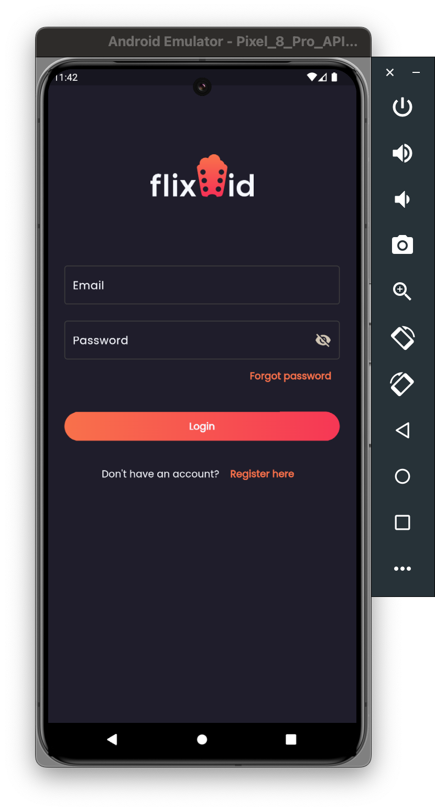
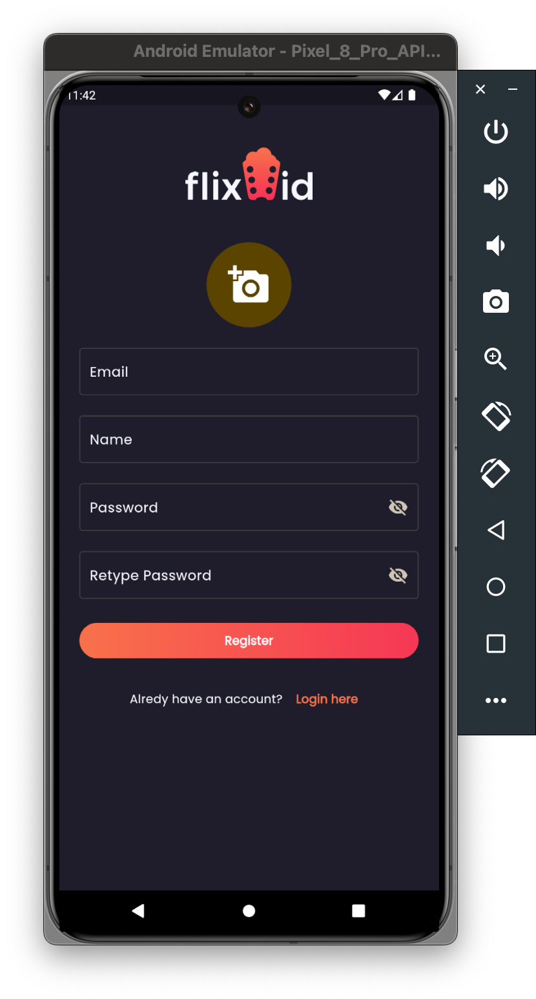
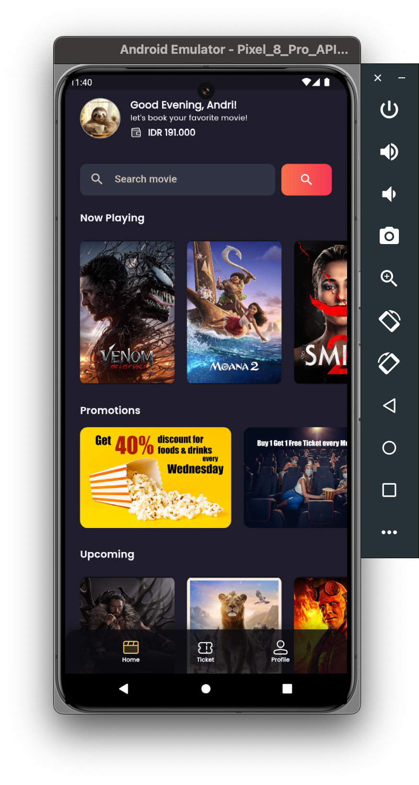
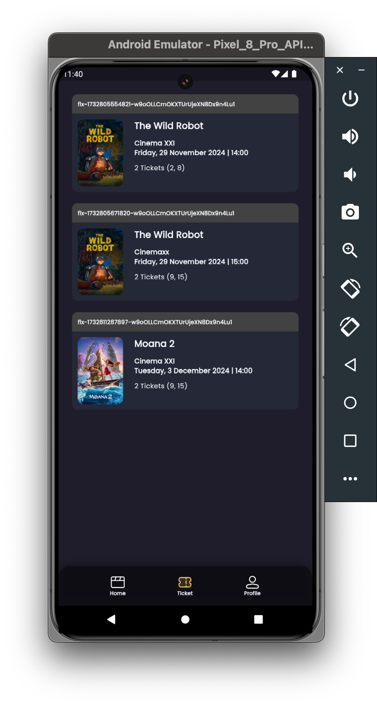
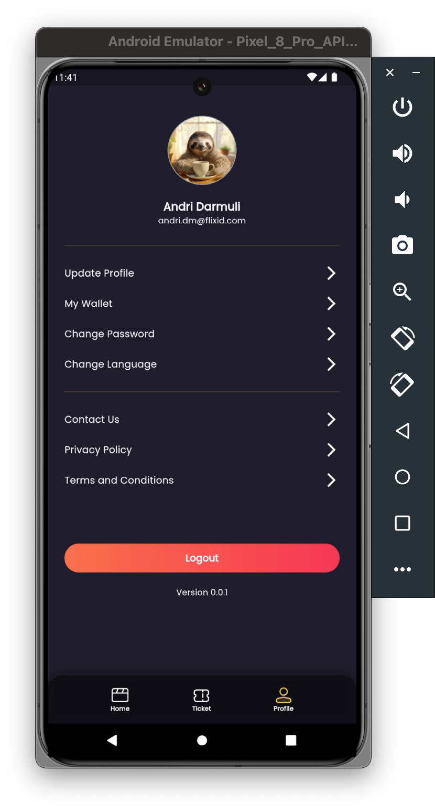
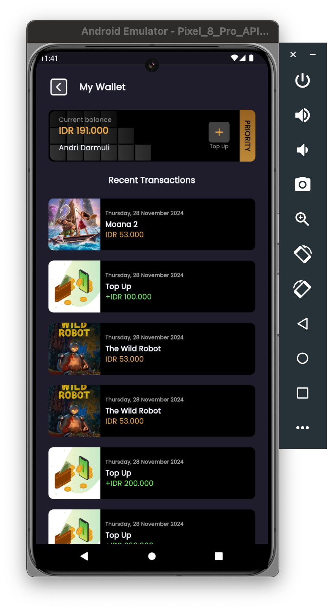
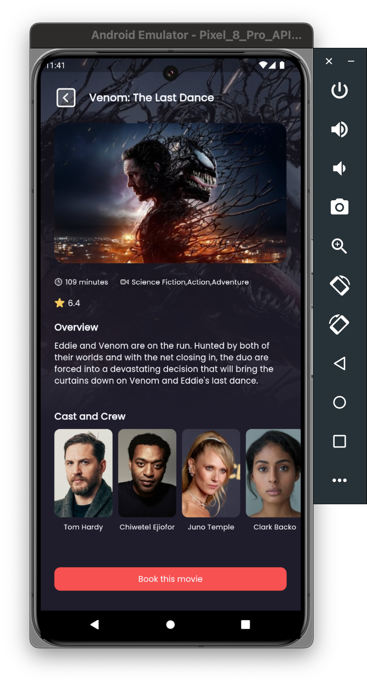
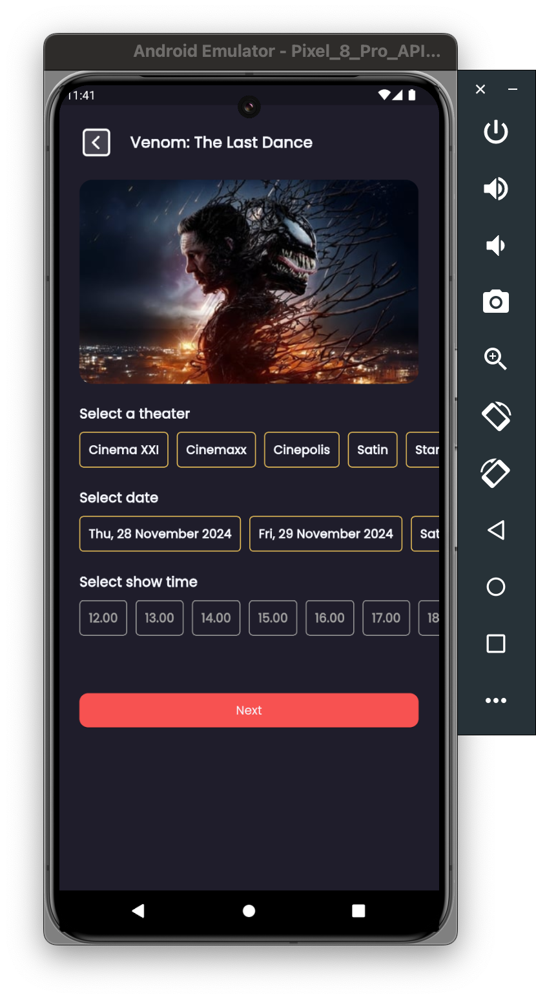
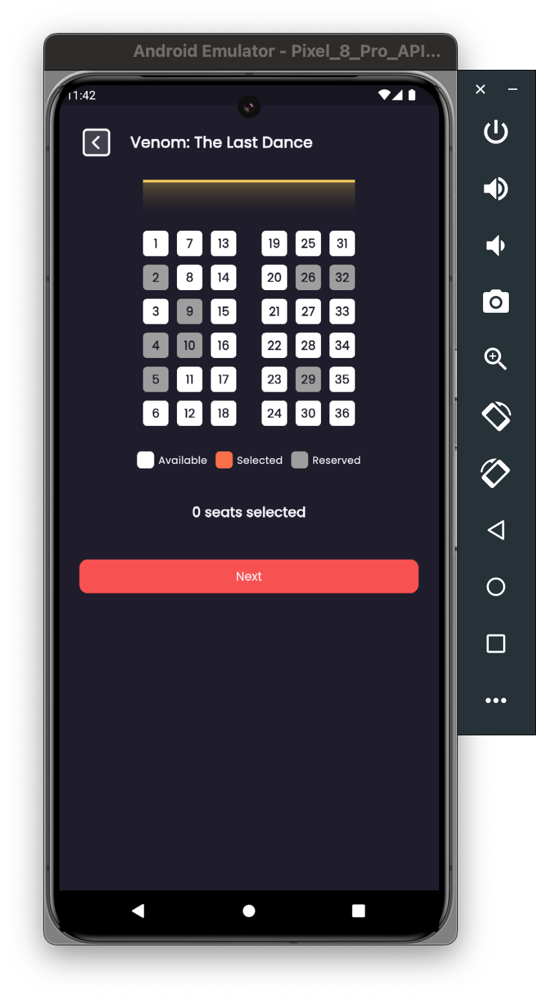

# flixid

A new Flutter Riverpod project cinema tickets with TMDB & firebase .

## Getting Started

This project is a starting point for a Flutter application.

A few resources to get you started if this is your first Flutter project:

<a href="https://flutter.dev/">
  <h1 align="center">
    <picture>
      <source media="(prefers-color-scheme: dark)" srcset="https://storage.googleapis.com/cms-storage-bucket/6e19fee6b47b36ca613f.png">
      
    </picture>
  </h1>
</a>

- [Lab: Write your first Flutter app](https://docs.flutter.dev/get-started/codelab)
- [Cookbook: Useful Flutter samples](https://docs.flutter.dev/cookbook)
- [State management : Riverpod](https://riverpod.dev/)
- [Dataabase : Firebase](https://firebase.google.com/)

For help getting started with Flutter development, view the
[online documentation](https://docs.flutter.dev/), which offers tutorials,
samples, guidance on mobile development, and a full API reference.

Examples

    <table>
        <tr>
            <td style="text-align: center">
                
            </td>            
            <td style="text-align: center">
                
            </td>
            <td style="text-align: center">
                
            </td>
        </tr>
        <tr>
            <td style="text-align: center">
                
            </td>
            <td style="text-align: center">
                
            </td>
            <td style="text-align: center">
                
            </td>
        </tr>
        <tr>
            <td style="text-align: center">
                
            </td>
            <td style="text-align: center">
                
            </td>
            <td style="text-align: center">
                
            </td>
        </tr>
    </table>

